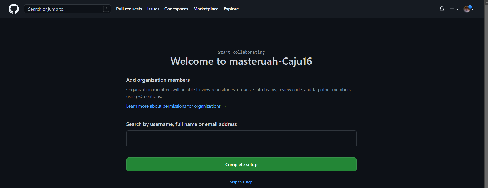

# masteruah
# Solución ejercicios Git, GitHub y Markdown

## Repositorio masteruah

1. Crear un repositorio en vuestro GitHub llamado **masteruah**.

1. Clonar vuestro repositio en local.

<h2>*Solución: git clone https://github.com/Caju16/masteruah</h2>

## README

1. Crear (si no lo habéis creado ya) en vuestro repositorio local
un documento **README.md**.

<h2>*Solución: Clic derecho sobre la carpeta contenedora -> nuevo documento de texto -> README.md</h2>

## Commit inicial

1. Añadir al README.md los comandos utilizados hasta ahora
y hacer un coomit inicial con el mensaje **commit inicial**.

<h2>*Solución: 1-.git add README.md || 2-.git commit -m "commit inicial"</h2>

## Push inicial

1. Subir los cambios al repositorio remoto.

<h2>*Solución: git push</h2>

## Añadir fichero 1.txt

1. Añadir fichero **1.txt** al repositorio local.

<h2>*Solución: Clic derecho sobre la carpeta contenedora -> nuevo documento de texto -> 1.txt -> git add "fichero 1.txt"</h2>

## Crear el tag v0.1

1. Crear un tag **v0.1**.

<h2>*Solución: git tag v0.1</h2>

## Subir el tag v0.1

1. Subir los cambios al repositorio remoto.

<h2>*Solución: git push --tags</h2>

## Crear una rama v0.2

1. Crear una rama **v0.2**.

<h2>*Solución: git branch v0.2</h2>

1. Posiciona tu carpeta de trabajo en esta rama.

<h2>*Solución: git checkout v0.2</h2>

## Añadir fichero 1.txt

1. Añadir un fichero **2.txt** en la rama **v0.2**.

<h2>*Solución: echo "Contenido del fichero 2" > 2.txt || git add 2.txt || git commit -m "Añadir fichero 2.txt a la rama v0.2"</h2>

## Crear rama remota v0.2

1. Subir los cambios al reposiorio remoto.

<h2>*Solución: git push -u origin origin v0.2</h2>

## Merge directo

1. Posicionarse en la rama **master**.

<h2>*Solución: git checkout main</h2>

1. Hacer un merge de la rama **v0.2** en la rama **master**.

<h2>*Solución: git merge v0.2</h2>

## Merge con conflicto

1. En la rama **master** poner **Hola** en el fichero **1.txt** y hacer commit.

<h2>*Solución: Escribir "hola" en el fichero -> git add "fichero 1.txt" -> git commit -m "Agregado Hola en fichero 1.txt en la rama main"</h2>

1. Posicionarse en la rama **v0.2** y poner **Adios** en el fichero "1.txt" y hacer commit.

<h2>*Solución: git checkout v0.2-> echo "Adios" > "fichero 1.txt" -> git add "fichero 1.txt" -> git commit -m "Agregado Adios en fichero_1.txt en la rama v0.2"</h2>

1. Posicionarse de nuevo en la rama **master** y hacer un merge con la rama **v0.2**

<h2>*Solución: git checkout main -> git merge v0.2</h2>

## Listado de ramas

1. Listar las ramas con merge y las ramas sin merge.

<h2>*Solución: git branch --merge (lista ramas con merge) || git branch --no-merge (lista ramas sin merge)</h2>

## Arreglar conflicto

1. Arreglar el conflicto anterior y hacer un commit.

<h2> vim "fichero_1.txt" || git add "fichero_1.txt" || git commit -m "Resuelto conflicto en fichero 1.txt" </h2>

## Borrar rama

1. Crear un tag **v0.2**

<h2>*Solución: git tag v0.2</h2>

1. Borrar la rama **v0.2**

<h2>*Solución: git branch -D v0.2</h2>

## Listado de cambios

1. Listar los distintos commits con sus ramas y sus tags.

<h2>*Solución: git log --oneline --decorate --all</h2>

## Cuenta de GitHub

1. Poner una foto en vuestro perfil de GitHub.

<h2>*Solución: clic en el menú desplegable del usuario -> settings -> edit profile pic</h2>

1. Poner el doble factor de autentificación en vuestra cuenta de GitHub.

<h2>*Solución: clic en el menú desplegable del usuario -> settings -> Password and authentication -> two-factor authentication (seguir los pasos que indique)</h2>

1. Añadir (si no lo habéis hecho ya) la clave pública que se corresponde a tu ordenador.

<h2>*Solución: (en el cmd de windows) -> ssh-keygen (con nombre github) -> (en el bash de git) -> cd ~/.ssh -> ssh-keygen -> cat ~/-ssh/github -> copiar el texto

-> clic en el menú desplegable del usuario -> settings -> SSH and GPG keys -> new SSH key -> pegar el texto del ssh</h2>

## Uso social de GitHub

1. Preguntar los nombres de usuario de GitHub de tus compañeros de trabajo en grupo, búscalos, y sigueles.

1. Añadir una estrella a los repositorios del resto de tus compañeros.

## Crear una tabla

1. Crear una tabla de este estilo en el fichero **README.md** con la información
de varios de tus compañeros de clase:

<table>
  
  <tr>
    <th>Nombre</th>
    <th>Github</th>
  </tr>
  
  <tr>
    <td>Julián</td>
    <td>https://github.com/Akwarck</td>
  </tr>
  
  <tr>
    <td>Mario</td>
    <td>https://github.com/Ayusox1</td>
  </tr>
  
   <tr>
    <td>Javier</td>
    <td>https://github.com/JLFcmd</td>
  </tr>
</table>

## Colaboradores

1. Poner a [github.com/i12vecaj](http://github.com/i12vecaj) como colaborador
del repositorio **masteruah**

## Crear una organización

1. Crear una organización llamada **masteruah-tunombredeusuariodegithub**

## Crear equipos

1. Crear 2 equipos en la organización **masteruah-tunombredeusuariodegithub**,
uno llamado **administradores** con más permisos y otro **colaboradores** con menos permisos.

1. Meter a [github.com/i12vecaj](http://github.com/i12vecaj) y a 2 de vuestros
compañeros de clase en el equipo **administradores**.

<h2>*Solución: En nuestra organización ir a settings -> collaborators and teams -> add people -> buscar a 2 compañeros</h2>

1. Meter a [github.com/i12vecaj](http://github.com/i12vecaj) y a otros 2 de vuestros
compañeros de clase en el equipo **colaboradores**.

<h2>*Solución: En nuestra organización ir a settings -> collaborators and teams -> add people -> buscar a 2 compañeros</h2>

## Crear un index.html

1. Crear un index.html que se pueda ver como página web en la organización.

## Crear Pull-requests

1. Hacer 2 forks de 2 repositorios **masteruah-tunombredeusuariodegithub.github.io**
de 2 organizaciones de las que no seais ni administradiores ni colaboradores.

1. Crearos una rama en cada fork.

<h2> *Solución: En la organización que hemos hecho fork -> new branch</h2>

1. En cada rama modificar el fichero **index.html** añadiendo vuestro nombre.

1. Con cada rama hacer un pull-request.

<h2>*Solución: En la organización en la que hemos hecho fork -> pull request -> new pull request -> create pull request</h2>

## Gestionar Pull-requests

1. Aceptar los pull-request que lleguen a los repositorios de tu organización.

